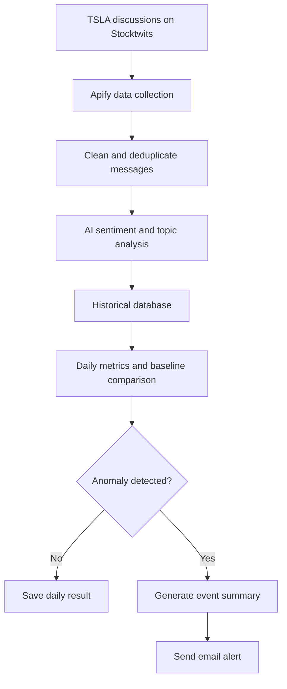
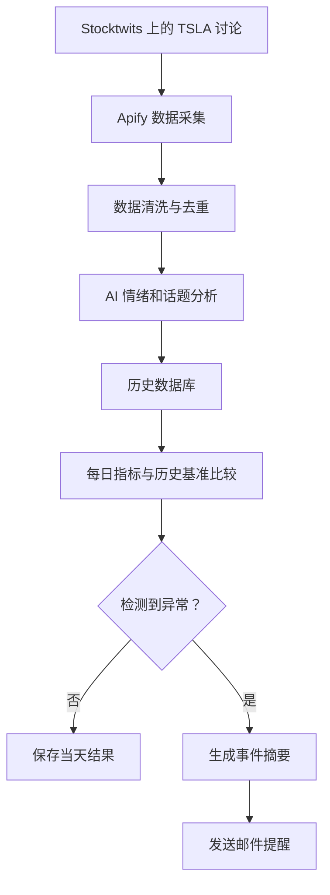

<div align="center">

# 📈 StockPulse

### AI-Powered Stock Sentiment Anomaly Monitor

**Monitor investor discussions · Detect sentiment shifts · Explain what changed**

[](https://www.python.org/)
[](https://apify.com/)
[](https://stocktwits.com/)
[](#project-status)
[](LICENSE)

**English** · [简体中文](#简体中文)

</div>

---

## Overview

**StockPulse** is a cost-aware stock sentiment monitoring project that detects unusual changes in investor discussions.

Version 1 focuses exclusively on **Tesla (TSLA)**. Once per day, StockPulse collects TSLA-related posts from **Stocktwits** through **Apify**, classifies their sentiment, stores historical results, and compares current activity with a historical baseline.

> StockPulse does not try to predict stock prices. It asks a different question: **Is investor sentiment behaving unusually today—and what may be driving the change?**

## Project Goals

| Question | How StockPulse answers it |
|---|---|
| 💬 What are investors saying? | Analyze recent TSLA discussions on Stocktwits |
| 📊 Has sentiment changed? | Compare today's results with historical levels |
| 🚨 Is the change unusual? | Detect abnormal shifts in volume or sentiment |
| 🧠 What may have caused it? | Identify major topics and summarize representative posts |

## Product Destination

StockPulse is intended to become a small but complete cloud product, not remain a command-line experiment. The target release will provide:

- A polished web dashboard with clear manual controls
- Complete historical sentiment, message, anomaly, and run records
- Daily automated collection and analysis on Google Cloud
- Durable cloud storage that survives container restarts
- Visible run status, errors, model versions, and cost safeguards
- Historical charts, filters, drill-down views, and source-message links

The planned Google Cloud shape is a **Cloud Run service** for the web application and API, a **Cloud Run job** for collection and analysis, **Cloud Scheduler** for daily execution, and a durable managed datastore selected before deployment. Local SQLite remains appropriate for development but will not be treated as durable Cloud Run storage.

See [Product and Delivery Plan](docs/PROJECT_PLAN.md) for the complete feature scope, eight-stage delivery path, current status, and completion criteria.

## System Workflow



## V1 Scope

| Area | Decision |
|---|---|
| Monitored asset | **Tesla (TSLA)** only |
| Discussion source | **Stocktwits** |
| Collection method | **Apify Stocktwits scraper** |
| Schedule | Approximately **once per day** |
| Sentiment classes | Bullish · Neutral · Bearish |
| Main output | Daily metrics and anomaly alerts |
| Out of scope | Trading, price prediction, and financial advice |

## Data Model

### Collected fields

| Field | Description |
|---|---|
| `messageId` | Unique Stocktwits message ID used for deduplication |
| `createdAt` | Original publication time |
| `body` | Message text |
| `symbols` | Assets mentioned in the post |
| `stocktwitsSentiment` | Optional Bullish or Bearish label selected by the author |
| `username` | Author username |
| `followers` | Author follower count |
| `url` | Link to the original message |

### Generated fields

| Field | Description |
|---|---|
| `ai_sentiment` | Bullish, Neutral, or Bearish classification |
| `ai_confidence` | Confidence score for the classification |
| `ai_model` | Model used to create the classification |
| `ai_model_revision` | Pinned model revision used for reproducibility |
| `ai_low_confidence` | Whether confidence fell below the configured threshold |
| `analysis_version` | Pipeline, model, revision, and threshold identifier |
| `analyzed_at` | UTC time when analysis completed |

Stocktwits sentiment and AI sentiment are kept separate. A Stocktwits label reflects what the author selected; the AI label is StockPulse's independent analysis, including posts whose original sentiment is missing.

## Daily Analysis and Anomaly Detection

Each run is planned to calculate metrics such as:

| Metric | Example |
|---|---:|
| New messages collected | 100 |
| Bullish posts | 47% |
| Neutral posts | 29% |
| Bearish posts | 24% |
| Daily sentiment score | +0.23 |
| Main topic | Robotaxi |

After enough history is available, StockPulse will look for:

- Sudden increases in discussion volume
- Significant bullish or bearish sentiment shifts
- Unusual changes in discussion topics
- Repeated messages and low-quality noise

Example alert:

```text
TSLA SENTIMENT ANOMALY

Discussion volume: +210% versus historical average
Bearish sentiment: 24% → 58%
Main topics: Robotaxi, FSD, regulatory investigation

Summary: Investor sentiment became significantly more negative,
with discussion concentrated around autonomous-driving regulation.
```

## Cost-Aware Design

Apify usage is a real project constraint, so V1 intentionally stays small:

- Monitor only one asset: **TSLA**
- Collect data only **once per day**
- Use `messageId` to prevent duplicate storage and processing
- Keep only the fields needed for analysis
- Track Apify usage and avoid unnecessary test runs
- Scale frequency or coverage only after the MVP is validated

## Planned Tech Stack

| Technology | Purpose |
|---|---|
| Python | Core application and data processing |
| Apify | Stocktwits data collection |
| Stocktwits | Investor-discussion data source |
| Twitter-RoBERTa + Transformers | Local sentiment classification |
| SQLite | Historical storage for V1 |
| Web API and dashboard | Planned interactive product interface |
| Docker | Reproducible application packaging |
| Google Cloud Run service | Planned dashboard and API hosting |
| Google Cloud Run job | Planned batch collection and analysis |
| Google Cloud Scheduler | Planned daily scheduling |
| Durable managed datastore | Planned cloud history and run storage |
| Gmail API | Planned anomaly email alerts |
| GitHub | Version control and documentation |

## Local Collection and Analysis Commands

StockPulse separates free local commands from the command that starts a paid Actor run.

```powershell
# Install the lightweight collection and storage dependencies.
python -m pip install -r requirements.txt

# Install the optional local AI dependencies before using --analyze.
python -m pip install -r requirements-ai.txt

# Make the src package available in the current PowerShell session.
$env:PYTHONPATH = "src"

# Preview configuration. This does not contact Apify.
python -m stockpulse.main

# Explicitly start one cost-capped Actor run.
python -m stockpulse.main --collect

# Read an existing successful run without starting another Actor.
python -m stockpulse.main --resume-run YOUR_RUN_ID

# Show daily statistics stored in local SQLite. This does not contact Apify.
python -m stockpulse.main --stats

# Analyze only messages that do not already have AI sentiment.
# The first run downloads the public model; it never contacts Apify.
python -m stockpulse.main --analyze

# Force one batch through the current version; use --analysis-limit to size it.
python -m stockpulse.main --reanalyze

# Show daily AI sentiment, confidence, and label-agreement statistics.
python -m stockpulse.main --ai-stats

# Show recent collection and analysis runs without contacting Apify.
python -m stockpulse.main --runs
```

The real `.env`, raw JSON files, and SQLite database are excluded from Git. The current test configuration limits a run to **5 messages**, **5 minutes**, and **$0.05 maximum Actor charge**.

Sentiment analysis is an **experimental adapter** built on `cardiffnlp/twitter-roberta-base-sentiment-latest`. The model revision is pinned for reproducibility. Positive, neutral, and negative model labels map to Bullish, Neutral, and Bearish, but this mapping still requires evaluation on a larger finance-specific sample. Predictions below the default **0.60 confidence threshold keep their original direction** and are marked as low-confidence instead of being rewritten as Neutral. The model revision, threshold, and analysis version are stored with each result. Stocktwits author labels remain separate and are never overwritten.

## Current Project Structure

```text
StockPulse/
├── src/
│   └── stockpulse/
│       ├── collector/
│       │   └── apify_client.py
│       ├── sentiment.py
│       ├── storage.py
│       └── main.py
├── data/
├── tests/
├── .env.example
├── .gitignore
├── requirements.txt
├── requirements-ai.txt
└── README.md
```

> Anomaly detection, notifications, and Docker files will be added in later phases.

## Roadmap

### Phase 0 — Research and Planning

- [x] Define the project goal and V1 scope
- [x] Select TSLA as the first monitored asset
- [x] Select Stocktwits as the data source
- [x] Select Apify as the collection platform
- [x] Run a successful Stocktwits scraping test
- [x] Retrieve and inspect real TSLA messages

### Phase 1 — Project Setup

- [x] Create the local Python project
- [x] Create a virtual environment
- [x] Add configuration and dependency files
- [x] Connect the local project to GitHub

### Phase 2 — Collection and Storage

- [x] Connect Python to Apify
- [x] Retrieve and parse TSLA messages
- [x] Validate required fields and handle errors
- [x] Deduplicate messages by `messageId`
- [x] Store raw messages and daily statistics

### Phase 3 — AI Analysis

- [x] Add an experimental Bullish, Neutral, and Bearish sentiment adapter
- [x] Generate confidence scores
- [ ] Extract major discussion topics
- [x] Compare AI sentiment with author-selected labels
- [ ] Evaluate classification quality

### Phase 4 — Baseline and Detection

- [ ] Build a historical daily baseline
- [ ] Define anomaly thresholds
- [ ] Detect unusual volume and sentiment changes
- [ ] Reduce false and duplicate alerts

### Phase 5 — Summaries and Alerts

- [ ] Select representative messages
- [ ] Generate concise, evidence-based summaries
- [ ] Design and test email alerts
- [ ] Send alerts only when an anomaly is detected

### Phase 6 — Automation and Deployment

- [ ] Add logging, retry logic, and usage monitoring
- [ ] Package the application with Docker
- [ ] Deploy to Google Cloud Run
- [ ] Schedule one daily run
- [ ] Configure secrets and cost alerts

## Project Status

> 🚧 **Currently in active development**

```text
Completed: planning, Python setup, cost-capped collection, local history, and an experimental sentiment adapter
Current milestone: durable metrics/run-history design, financial-direction evaluation, and topic extraction
Product destination: Google Cloud deployment with a polished dashboard and complete historical records
Delivery status: stage 1 of 8 complete; 7 major stages remain
```

## Future Ideas

- Multi-stock and cryptocurrency monitoring
- X, Reddit, or other discussion sources
- Higher-frequency monitoring
- Cross-platform sentiment comparison
- Sentiment and market-price correlation research
- Mobile or chat notifications

## Disclaimer

StockPulse is an educational and research project. It does **not** provide financial advice, investment recommendations, automated trading, or guaranteed price predictions. All outputs are informational only.

---

<a id="简体中文"></a>

<div align="center">

# 🇨🇳 StockPulse 中文介绍

[返回英文](#-stockpulse)

</div>

## 项目简介

**StockPulse** 是一个注重成本控制的股票舆情异常监控项目，用于发现投资者讨论中不同寻常的变化。

第一版只监控 **Tesla（TSLA）**。系统计划每天运行一次，通过 **Apify** 获取 **Stocktwits** 上与 TSLA 相关的帖子，分析情绪并保存历史结果，再将当天情况与历史基准进行比较。

> StockPulse 不预测股票价格。它关注的问题是：**今天的投资者情绪是否异常？可能是什么原因造成的？**

## 项目目标

| 问题 | StockPulse 的处理方式 |
|---|---|
| 💬 投资者在说什么？ | 分析 Stocktwits 上近期的 TSLA 讨论 |
| 📊 情绪是否变化？ | 将当天结果与历史水平比较 |
| 🚨 变化是否异常？ | 检测讨论量和情绪比例的异常波动 |
| 🧠 可能是什么原因？ | 提取主要话题并总结代表性帖子 |

## 最终产品目标

StockPulse 的目标是成为一个小而完整的云端产品，而不是停留在命令行实验阶段。目标版本将提供：

- 具有清晰操作按钮的正式 Web Dashboard
- 完整的历史情绪、帖子、异常事件与运行记录
- 在 Google Cloud 上自动执行每日采集和分析
- 容器重启后仍能保留的持久化云端数据
- 可查看的运行状态、错误、模型版本与费用保护信息
- 历史图表、筛选、详情下钻以及原帖链接

计划中的 Google Cloud 结构是：使用 **Cloud Run service** 承载 Dashboard 与 API，使用 **Cloud Run job** 执行采集和分析，通过 **Cloud Scheduler** 每日调度，并在部署前选择持久化托管数据存储。本地 SQLite 继续用于开发，但不会被当作 Cloud Run 上的持久化存储。

完整功能范围、八阶段交付路线、当前进度和完成标准，请查看 [产品与交付计划](docs/PROJECT_PLAN.md)。

## 系统流程



## 第一版范围

| 项目 | 决定 |
|---|---|
| 监控标的 | 只监控 **Tesla（TSLA）** |
| 讨论来源 | **Stocktwits** |
| 采集方式 | **Apify Stocktwits Scraper** |
| 运行频率 | 大约**每天一次** |
| 情绪分类 | 看多 · 中性 · 看空 |
| 主要输出 | 每日舆情指标与异常提醒 |
| 不包含 | 自动交易、股价预测和投资建议 |

## 数据设计

### 采集字段

| 字段 | 说明 |
|---|---|
| `messageId` | Stocktwits 帖子唯一 ID，用于去重 |
| `createdAt` | 原始发帖时间 |
| `body` | 帖子正文 |
| `symbols` | 帖子提到的股票或资产 |
| `stocktwitsSentiment` | 作者主动选择的 Bullish / Bearish 标签，可为空 |
| `username` | 作者用户名 |
| `followers` | 作者粉丝数量 |
| `url` | 原始帖子链接 |

### 系统生成字段

| 字段 | 说明 |
|---|---|
| `ai_sentiment` | 看多、中性或看空 |
| `ai_confidence` | AI 情绪判断的置信度 |
| `ai_model` | 生成分类结果所使用的模型 |
| `ai_model_revision` | 用于保证结果可复现的固定模型 revision |
| `ai_low_confidence` | 置信度是否低于配置阈值 |
| `analysis_version` | 管线、模型、revision 与阈值的组合标识 |
| `analyzed_at` | 完成分析时的 UTC 时间 |

Stocktwits 用户标签与 AI 判断会分开保存。前者是作者自己的选择，后者是 StockPulse 对文字内容的独立分析，也可以处理原始情绪标签为空的帖子。

## 每日分析与异常检测

每次运行计划计算以下指标：

| 指标 | 示例 |
|---|---:|
| 新增帖子 | 100 |
| 看多 | 47% |
| 中性 | 29% |
| 看空 | 24% |
| 每日情绪分数 | +0.23 |
| 主要话题 | Robotaxi |

积累足够历史数据后，StockPulse 会重点检测：

- 讨论量突然上升
- 看多或看空情绪出现显著变化
- 讨论话题发生异常转移
- 重复内容和低质量噪声

## 成本控制

Apify 的使用成本是项目的重要限制，因此第一版会主动保持轻量：

- 只监控一个标的：**TSLA**
- 只在**每天运行一次**左右
- 使用 `messageId` 防止重复保存和分析
- 只保留分析所需字段
- 监控 Apify 用量，避免不必要的测试运行
- MVP 验证成功后，再考虑增加频率或标的数量

## 计划技术栈

| 技术 | 用途 |
|---|---|
| Python | 核心程序和数据处理 |
| Apify | Stocktwits 数据采集 |
| Stocktwits | 投资者讨论数据源 |
| Twitter-RoBERTa + Transformers | 本地情绪分类 |
| SQLite | 第一版历史数据存储 |
| Web API 与 Dashboard | 计划中的交互式产品界面 |
| Docker | 应用容器化 |
| Google Cloud Run service | 计划中的 Dashboard 与 API 托管 |
| Google Cloud Run job | 计划中的批量采集与分析 |
| Google Cloud Scheduler | 计划中的每日定时任务 |
| 持久化托管数据存储 | 计划中的云端历史与运行记录存储 |
| Gmail API | 计划中的异常邮件提醒 |
| GitHub | 版本管理和项目文档 |

## 本地采集与分析命令

StockPulse 会把免费的本地命令与真正启动付费 Actor 的命令分开。

```powershell
# 安装轻量的数据采集与存储依赖
python -m pip install -r requirements.txt

# 使用 --analyze 前安装可选的本地 AI 依赖
python -m pip install -r requirements-ai.txt

# 让当前 PowerShell 会话能够找到 src 中的项目代码
$env:PYTHONPATH = "src"

# 预览配置，不连接 Apify
python -m stockpulse.main

# 明确启动一次带费用保护的 Actor Run
python -m stockpulse.main --collect

# 读取已经成功的 Run，不重新启动 Actor
python -m stockpulse.main --resume-run YOUR_RUN_ID

# 查看 SQLite 中的每日统计，不连接 Apify
python -m stockpulse.main --stats

# 只分析尚未生成 AI 情绪的帖子；首次运行会下载公开模型
# 该命令不会连接 Apify
python -m stockpulse.main --analyze

# 使用当前版本强制重跑一批帖子；可用 --analysis-limit 控制批量大小
python -m stockpulse.main --reanalyze

# 查看每日 AI 情绪、平均置信度和标签一致情况
python -m stockpulse.main --ai-stats

# 查看最近的采集与分析运行记录；不会连接 Apify
python -m stockpulse.main --runs
```

真实 `.env`、原始 JSON 和 SQLite 数据库均不会上传到 Git。当前测试配置将单次运行限制为 **5 条消息**、**5 分钟**和 **最高 0.05 美元 Actor 费用**。

情绪分析目前是基于 `cardiffnlp/twitter-roberta-base-sentiment-latest` 的**实验性适配器**，并固定模型 revision 以保证结果可复现。模型的 Positive、Neutral 和 Negative 会分别映射为 Bullish、Neutral 和 Bearish，但该映射仍需使用更大的金融语境样本进行评估。低于默认 **0.60 置信度阈值**的结果会保留原始方向并标记为低置信度，而不会被改写成 Neutral。每条结果会保存模型 revision、阈值与分析版本；Stocktwits 用户标签始终独立保存。

## 开发路线

| 阶段 | 内容 | 状态 |
|---|---|---|
| Phase 0 | 明确目标、选择数据源、完成真实抓取测试 | ✅ 已完成 |
| Phase 1 | 建立本地 Python 项目并连接 GitHub | ✅ 已完成 |
| Phase 2 | 使用 Python 采集、清洗、去重并保存数据 | ✅ 已完成 |
| Phase 3 | AI 情绪与话题分析 | 🔄 进行中：实验性情绪适配器已实现，质量评估待完成 |
| Phase 4 | 建立历史基准并检测异常 | ⏳ 待开始 |
| Phase 5 | 生成事件摘要和邮件提醒 | ⏳ 待开始 |
| Phase 6 | 自动化、Docker 和云端部署 | ⏳ 待开始 |

## 当前进度

> 🚧 **项目正在开发中**

```text
已完成：项目规划、Python 搭建、带费用保护的数据采集、本地历史记录和实验性情绪适配器
当前阶段：持久化指标与运行记录设计、金融方向评估和话题提取
最终目标：部署到 Google Cloud，并提供正式 Dashboard 和完整历史记录
交付进度：八个主要阶段中的第一阶段已完成，剩余七个阶段
```

## 后续扩展

- 多股票与加密货币监控
- 接入 X、Reddit 或其他讨论平台
- 提高监控频率
- 多平台情绪对比
- 舆情与市场价格的相关性研究
- 手机或聊天软件通知

## 免责声明

StockPulse 是一个学习与研究项目，不提供投资建议、自动交易或有保证的价格预测。所有分析结果仅供信息参考。

---

<div align="center">

### 🚀 StockPulse

**Detect the signal before it gets lost in the noise.**

</div>
