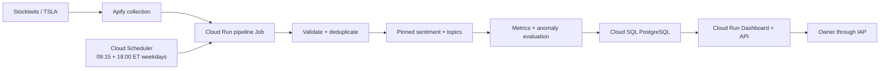
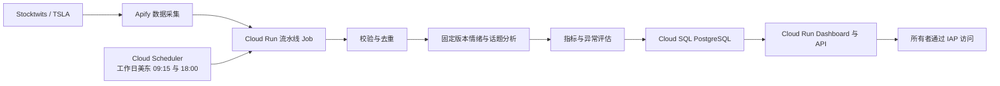

<div align="center">

# StockPulse

### Explainable TSLA investor-sentiment monitoring

**Collect · Analyze · Compare · Explain**

[](https://github.com/AndyChen227/StockPulse---V2/actions)
[](https://www.python.org/)
[](https://fastapi.tiangolo.com/)
[](docs/operations/google-cloud-runbook.md)
[](LICENSE)

[English](#english) · [简体中文](#简体中文)

</div>

---

<a id="english"></a>

# English

> **Current state — 2026-08-19:** the production foundation is provisioned in GCP project `stockpulse-production`, and the IAP-protected Dashboard is live on Cloud Run with Cloud SQL PostgreSQL. Historical SQLite migration was skipped because no local snapshot was found. **Next: build and deploy the AI pipeline Cloud Run Job, manually validate one run, then enable Scheduler and complete final verification.**

## What StockPulse does

StockPulse is a cost-aware monitoring product for **Tesla (TSLA) investor discussions on Stocktwits**. It collects a deliberately small data sample through Apify, preserves historical records, applies versioned AI sentiment and topic analysis, and explains unusual changes relative to a historical baseline.

It answers four practical questions:

1. What are investors discussing now?
2. How does current sentiment compare with recent history?
3. Is the change unusual?
4. Which topics and source messages explain the change?

StockPulse is an informational monitoring tool. It does **not** predict prices, execute trades, or provide financial advice.

## Product at a glance

| Area | Current implementation |
|---|---|
| Scope | TSLA only; Stocktwits discussions |
| Collection | Apify Actor with item, runtime, and cost ceilings |
| Schedule | Weekdays at **9:15 AM** and **6:00 PM**, `America/New_York` |
| Analysis | Pinned Twitter-RoBERTa sentiment, versioned topics, explainable anomaly rules |
| History | Messages, runs, metrics, topics, anomalies, versions, errors, and external IDs |
| Local database | SQLite |
| Production database | Cloud SQL for PostgreSQL 17 deployed and connected to the live Dashboard |
| Web product | Responsive FastAPI Dashboard with overview, trends, messages, and run history |
| Cloud target | Private Cloud Run service + Cloud Run Job + two Scheduler jobs + Cloud SQL |
| Deployment status | Production foundation and IAP-protected Dashboard live; pipeline Job and Scheduler pending |

## Dashboard

The Dashboard is served by the FastAPI application and requires no separate frontend server. It includes:

- Overview cards for sentiment score, volume, confidence, anomaly state, and latest run
- Bullish, Neutral, and Bearish distribution
- Date-range sentiment and volume history
- Current and historical discussion topics
- Explainable anomaly detail
- Searchable, filterable, cursor-paginated source-message explorer
- Complete collection and analysis run history
- Loading, empty, error, readiness, and responsive mobile states

Refreshing or filtering the Dashboard is read-only and cannot spend Apify credits. The visible collection control remains locked until browser identity, CSRF protection, cloud dispatch, and distributed idempotency are complete.

## End-to-end architecture



For local development, the same application uses SQLite. Cloud Run filesystems are disposable, so SQLite is intentionally not the production source of truth.

## What is complete

- Cost-capped Apify collection, validation, canonical UTC timestamps, and `messageId` deduplication
- Raw local snapshots and durable structured run records
- SQLite schema migration history and protection against unsupported newer schemas
- Backend-neutral repository contract with SQLite and PostgreSQL implementations
- Versioned sentiment analysis with a pinned model revision and explicit confidence threshold
- Safe, idempotent reanalysis behavior and low-confidence tracking
- A reproducible 36-example finance-direction benchmark and a documented FinBERT comparison
- Versioned multi-label TSLA topic taxonomy and representative-message ranking
- Daily sentiment, volume, confidence, and topic metrics
- A versioned 28-day rolling-median anomaly baseline with topic-shift evidence
- Read-only REST API and guarded, disabled-by-default collection action contract
- Polished responsive Dashboard
- Cloud Run service image and separate pinned-model Job image
- Transactional, repeatable SQLite-to-PostgreSQL migration tooling
- Production configuration preflight for service and Job
- Offline-reviewed deployment renderer requiring immutable image digests and numeric secret versions
- Two no-retry weekday Scheduler contracts at 09:15 and 18:00 Eastern
- GitHub Actions validation on Python 3.11 and 3.12, both containers, and PostgreSQL

The complete milestone-by-milestone record is in [Project History](docs/product/project-history.md).

## What is deliberately not complete

- The AI pipeline image has not yet been built and deployed as a Cloud Run Job
- One bounded manual pipeline run must pass before Scheduler is enabled
- Scheduler, final backup/restore verification, observability checks, and the rollback exercise remain pending
- Historical SQLite migration was intentionally skipped because no local database snapshot was found
- Browser-triggered collection remains disabled
- Email or external anomaly notification delivery is not implemented
- The first 36-example sentiment benchmark is provisional and needs a larger human-reviewed set
- Topic and anomaly thresholds need calibration against a representative production history
- Durable cloud archival of raw Apify JSON snapshots is not yet designed

## Run locally

Requirements: Python 3.11 or 3.12.

```powershell
python -m venv .venv
.venv\Scripts\Activate.ps1
python -m pip install --upgrade pip
python -m pip install -e .
stockpulse-api
```

Open:

- Dashboard: `http://localhost:8080`
- Interactive API documentation: `http://localhost:8080/docs`
- Health: `http://localhost:8080/api/v1/health`

An empty database is valid and shows intentional empty states. Starting the Dashboard never starts a paid Apify run.

### Optional AI and PostgreSQL dependencies

```powershell
python -m pip install -e ".[ai,postgres]"
```

Copy `config/env.example` to an untracked root `.env` only when collection is required. Never commit API tokens or database credentials.

### Explicit collection commands

```powershell
# Preview limits without calling Apify.
stockpulse --dry-run

# This command can start a paid, bounded Actor run.
stockpulse --collect

# Analyze records missing the current analysis version.
stockpulse --analyze

# Display recent operational history.
stockpulse --runs
```

The default collection contract is intentionally small: at most 5 items, a 60-second Actor timeout, and a maximum recorded cost ceiling of USD 0.05 per run.

## Test and validation

```powershell
python -m pytest
python -m compileall -q src tests
```

At the current milestone, the local run reports **121 tests and 37 subtests passed**, with **8 PostgreSQL integration tests intentionally deferred to CI**. GitHub Actions validates Python 3.11, Python 3.12, the service image, the AI Job image, and PostgreSQL behavior.

## Approved first cloud release

The deployed first-release configuration and remaining boundaries are:

| Decision | Approved value |
|---|---|
| Region | `us-west1` |
| Access | Direct Cloud Run IAP; owner Google account only |
| Service | Scale to zero; maximum one instance initially |
| Database | PostgreSQL 17, `db-f1-micro`, single-zone, non-HA |
| Backups | Daily backup, 7-day PITR, deletion protection, restore drill |
| Schedule | Weekdays 09:15 and 18:00 `America/New_York`; no retries |
| Budget | USD 20 monthly alert budget at 50%, 80%, and 100% |
| Credits | USD 300 Google Cloud trial credit confirmed and attached |
| Manual collection | Locked in the first release |

The trial credit and billing attachment were confirmed in the authenticated Google Cloud console. A budget alert warns about spend; it does not automatically cap or stop resources.

Follow [Google Cloud Launch Runbook](docs/operations/google-cloud-runbook.md) in order. Rendering deployment files is offline and does not create resources; applying them is a separate owner-approved action.

## Documentation

Start with the [Documentation Guide](docs/README.md).

| Document | Purpose |
|---|---|
| [Project History](docs/product/project-history.md) | Complete bilingual milestone and PR record |
| [Product and Delivery Plan](docs/product/project-plan.md) | Current status, remaining work, and definition of done |
| [Google Cloud Launch Runbook](docs/operations/google-cloud-runbook.md) | Provisioning, IAM, cost, backup, validation, and rollback |
| [Dashboard](docs/product/dashboard.md) | UI views and safety boundary |
| [Product API](docs/architecture/api.md) | Endpoint and response contracts |
| [PostgreSQL](docs/architecture/postgresql.md) | Production repository and migration behavior |
| [Cloud Run](docs/architecture/cloud-run.md) | Container and runtime contracts |
| [Sentiment Evaluation](docs/analysis/sentiment-evaluation.md) | Benchmark and model comparison |
| [Topic Analysis](docs/analysis/topic-analysis.md) | Taxonomy and representatives |
| [Anomaly Detection](docs/analysis/anomaly-detection.md) | Baseline, rules, and replay behavior |

## Repository map

For a description of every tracked file and the safest place to make a change,
see the [Repository Guide](docs/reference/repository-guide.md). Every major directory also
contains a short bilingual `README.md` that explains its purpose and boundaries.

```text
StockPulse-V2/
├── config/                environment template and grouped dependency sets
├── containers/            service and pipeline Job Docker definitions
├── data/                  ignored local runtime data (not the cloud source of truth)
├── deploy/                reviewed offline Google Cloud deployment templates
├── docs/                  product, architecture, analysis, and operations documentation
├── evaluations/           reproducible sentiment evaluation data and results
├── src/stockpulse/        application, analysis, repositories, API, and web UI
└── tests/                 unit, contract, container, migration, and integration tests
```

## License and disclaimer

MIT licensed. StockPulse is for engineering and informational research only and is not financial advice.

---

<a id="简体中文"></a>

# 简体中文

> **当前状态（2026-08-19）：** GCP 项目 `stockpulse-production` 的生产基础设施已配置完成，受 IAP 保护的 Dashboard 已在 Cloud Run 上线并连接 Cloud SQL PostgreSQL。由于没有找到本地 SQLite 快照，历史迁移已跳过。**下一步：构建并部署 AI 流水线 Cloud Run Job，手动验证一次运行，然后启用 Scheduler 并完成最终验证。**

## StockPulse 是什么

StockPulse 是一个注重成本控制的 **Tesla（TSLA）Stocktwits 投资者讨论监测产品**。它通过 Apify 采集规模受控的数据，保留完整历史，执行带版本的 AI 情绪与话题分析，并通过历史基线解释异常变化。

它回答四个实际问题：

1. 投资者现在正在讨论什么？
2. 当前情绪与近期历史相比如何？
3. 这种变化是否异常？
4. 哪些话题和原始消息可以解释这种变化？

StockPulse 只提供信息监测，不预测股价、不执行交易，也不构成投资建议。

## 产品概览

| 领域 | 当前实现 |
|---|---|
| 范围 | 仅 TSLA；Stocktwits 讨论 |
| 采集 | Apify Actor，并限制条数、运行时间和成本 |
| 计划时间 | 每个工作日美东时间 **上午 9:15** 和 **下午 6:00** |
| 分析 | 固定版本的 Twitter-RoBERTa、版本化话题和可解释异常规则 |
| 历史 | 消息、任务、指标、话题、异常、版本、错误和外部运行 ID |
| 本地数据库 | SQLite |
| 生产数据库 | Cloud SQL for PostgreSQL 17 已部署并连接线上 Dashboard |
| Web 产品 | 响应式 FastAPI Dashboard，包含概览、趋势、消息和运行历史 |
| 云端目标 | 私有 Cloud Run 服务 + Cloud Run Job + 两个 Scheduler 任务 + Cloud SQL |
| 部署状态 | 生产基础设施和受 IAP 保护的 Dashboard 已上线；流水线 Job 和 Scheduler 待完成 |

## Dashboard

Dashboard 由 FastAPI 应用直接提供，不需要额外的前端服务器，包含：

- 情绪分数、讨论量、置信度、异常状态和最近一次运行的概览卡片
- Bullish、Neutral、Bearish 分布
- 可选日期范围的情绪和讨论量历史
- 当前与历史讨论话题
- 可解释的异常详情
- 支持搜索、筛选和游标分页的原始消息浏览器
- 完整的采集与分析运行历史
- 加载、空数据、错误、就绪状态和移动端响应式界面

刷新或筛选 Dashboard 只读取数据，不会消耗 Apify 额度。界面中的采集按钮会继续保持锁定，直到浏览器身份验证、CSRF 防护、云端任务触发和分布式幂等性全部完成。

## 端到端架构



本地开发使用同一套应用和 SQLite。Cloud Run 的文件系统并不持久，因此生产环境不会把 SQLite 作为历史数据的最终来源。

## 已完成的工作

- 带成本上限的 Apify 采集、数据校验、UTC 时间标准化和 `messageId` 去重
- 本地原始 JSON 快照和持久化结构化运行记录
- SQLite 模式迁移历史，以及阻止旧程序打开未来数据库模式的保护
- 与后端无关的仓库契约，以及 SQLite 和 PostgreSQL 两种实现
- 固定模型 revision、明确置信度阈值的版本化情绪分析
- 安全、幂等的重新分析行为和低置信度记录
- 可复现的 36 条金融方向基准，以及有记录的 FinBERT 对比
- 版本化、多标签的 TSLA 话题体系和代表消息排序
- 每日情绪、讨论量、置信度和话题指标
- 版本化的 28 天滚动中位数异常基线，并加入话题变化证据
- 只读 REST API，以及默认禁用、受保护的采集操作契约
- 完整的响应式 Dashboard
- Cloud Run 服务镜像和独立的固定模型 Job 镜像
- 事务化、可重复执行的 SQLite 到 PostgreSQL 迁移工具
- 服务与 Job 的生产配置预检
- 离线部署渲染器，强制不可变镜像摘要和数字化 Secret 版本
- 两个不自动重试的工作日计划：美东 09:15 与 18:00
- Python 3.11、3.12、两个容器和 PostgreSQL 的 GitHub Actions 验证

完整的逐项里程碑记录，请阅读[项目历程](docs/product/project-history.md)。

## 明确尚未完成的工作

- AI 流水线镜像尚未构建并部署为 Cloud Run Job
- 启用 Scheduler 前，必须先成功完成一次有明确成本上限的手动流水线运行
- Scheduler、最终备份恢复验证、可观测性检查和回滚演练仍待完成
- 由于没有找到本地 SQLite 数据库快照，历史迁移已明确跳过
- 浏览器触发采集仍处于禁用状态
- 邮件或外部异常通知尚未实现
- 当前 36 条情绪基准仍是临时基线，需要更大的人工复核数据集
- 话题和异常阈值仍需基于有代表性的生产历史进行校准
- Apify 原始 JSON 的云端持久归档方案尚未设计

## 本地运行

要求 Python 3.11 或 3.12。

```powershell
python -m venv .venv
.venv\Scripts\Activate.ps1
python -m pip install --upgrade pip
python -m pip install -e .
stockpulse-api
```

打开：

- Dashboard：`http://localhost:8080`
- API 交互文档：`http://localhost:8080/docs`
- 健康检查：`http://localhost:8080/api/v1/health`

空数据库是正常状态，页面会显示明确的空数据界面。启动 Dashboard 永远不会自动触发付费 Apify 任务。

### 可选 AI 与 PostgreSQL 依赖

```powershell
python -m pip install -e ".[ai,postgres]"
```

只有需要采集时，才把 `config/env.example` 复制为根目录下不受 Git 跟踪的 `.env`。绝不要提交 API Token 或数据库密码。

### 明确触发的采集命令

```powershell
# 只预览限制，不调用 Apify。
stockpulse --dry-run

# 可能启动一个付费但有明确上限的 Actor 任务。
stockpulse --collect

# 分析尚未使用当前版本处理的记录。
stockpulse --analyze

# 显示最近运行历史。
stockpulse --runs
```

默认采集契约刻意保持很小：最多 5 条、Actor 超时 60 秒、每次运行记录的成本上限为 0.05 美元。

## 测试与验证

```powershell
python -m pytest
python -m compileall -q src tests
```

在当前里程碑中，本地运行结果为 **121 项测试及 37 项子测试通过**，另有 **8 项 PostgreSQL 集成测试按设计只在 CI 中运行**。GitHub Actions 会验证 Python 3.11、Python 3.12、服务镜像、AI Job 镜像和 PostgreSQL 行为。

## 已批准的首个云端版本方案

首个云端版本已经部署的配置和剩余边界如下：

| 决策 | 已批准值 |
|---|---|
| 区域 | `us-west1` |
| 访问 | Cloud Run 直接使用 IAP，仅允许所有者 Google 账号 |
| 服务 | 可缩容到零，初期最多一个实例 |
| 数据库 | PostgreSQL 17、`db-f1-micro`、单区、非高可用 |
| 备份 | 每日备份、7 天时间点恢复、删除保护和恢复演练 |
| 计划 | 工作日 `America/New_York` 09:15 与 18:00，不自动重试 |
| 预算 | 每月 20 美元提醒预算，阈值 50%、80%、100% |
| 赠金 | 已确认并关联 300 美元 Google Cloud 试用额度 |
| 手动采集 | 首个版本继续锁定 |

试用额度和 Billing 关联已在登录后的 Google Cloud 控制台确认。预算提醒只负责告警，不会自动限制或停止支出。

部署必须按顺序遵循 [Google Cloud 上线运行手册](docs/operations/google-cloud-runbook.md)。渲染部署文件是完全离线的，不会创建资源；应用这些文件属于另一项需要所有者明确批准的操作。

## 文档导航

建议从[文档指南](docs/README.md)开始。

| 文档 | 用途 |
|---|---|
| [项目历程](docs/product/project-history.md) | 完整的双语里程碑与 PR 记录 |
| [产品与交付计划](docs/product/project-plan.md) | 当前状态、剩余工作和完成标准 |
| [Google Cloud 上线运行手册](docs/operations/google-cloud-runbook.md) | 资源配置、IAM、成本、备份、验证与回滚 |
| [Dashboard](docs/product/dashboard.md) | UI 视图与安全边界 |
| [产品 API](docs/architecture/api.md) | 接口与响应契约 |
| [PostgreSQL](docs/architecture/postgresql.md) | 生产仓库与迁移行为 |
| [Cloud Run](docs/architecture/cloud-run.md) | 容器与运行时契约 |
| [情绪评估](docs/analysis/sentiment-evaluation.md) | 基准与模型对比 |
| [话题分析](docs/analysis/topic-analysis.md) | 话题体系与代表消息 |
| [异常检测](docs/analysis/anomaly-detection.md) | 基线、规则与历史重放 |

## 仓库结构

如果需要查看每个受 Git 跟踪文件的用途，以及修改某项功能时应从哪里开始，
请阅读[仓库指南](docs/reference/repository-guide.md)。每个主要目录也包含一份简短的
双语 `README.md`，说明该目录的用途和边界。

```text
StockPulse-V2/
├── config/                环境模板和分类依赖集合
├── containers/            服务与流水线 Job 的 Docker 定义
├── data/                  被忽略的本地运行数据，不是云端事实来源
├── deploy/                已审查的离线 Google Cloud 部署模板
├── docs/                  产品、架构、分析和运维文档
├── evaluations/           可复现的情绪评估数据和结果
├── src/stockpulse/        应用、分析、数据仓库、API 和 Web UI
└── tests/                 单元、契约、容器、迁移和集成测试
```

## 许可证与免责声明

本项目采用 MIT License。StockPulse 仅用于工程与信息研究，不构成投资建议。
